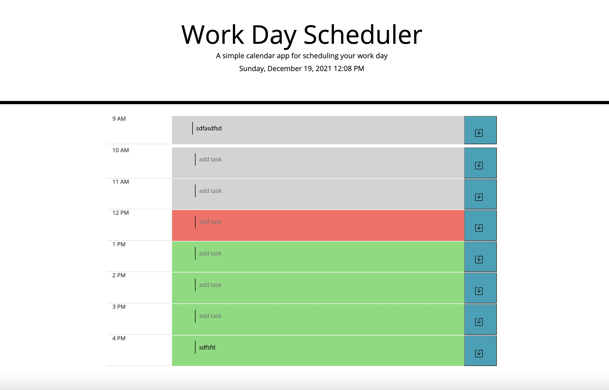

# my-calender

## Purpose
A website that allows user to schedule their workday. The application will color code the time blocks informing the user of the status of each time block. 

## Built With
* HTML
* CSS
* Javascript

## Screenshots

## Website
https://woffordlm.github.io/my-calender/